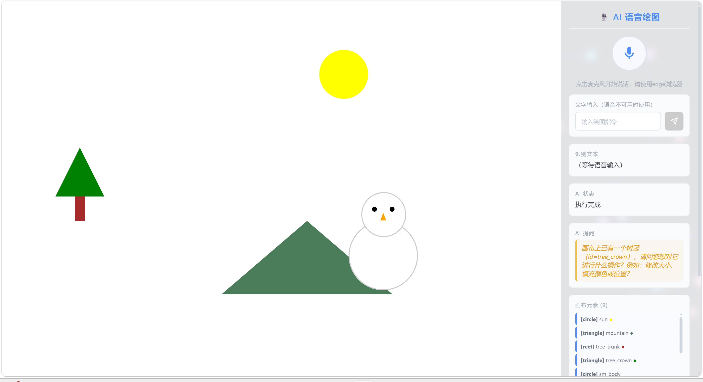

# 🎨 AI 语音绘图工具

> **纯语音驱动**的在线绘图应用 —— 用户不能使用鼠标或键盘，仅通过语音指令完成所有绘图创作。

---

## 📋 目录

1. [项目概览](#项目概览)
2. [快速开始](#快速开始)
3. [使用指南](#使用指南)
4. [核心约束与设计原则](#核心约束与设计原则)
5. [指令理解准确性与容错](#指令理解准确性与容错)
6. [响应延迟分析](#响应延迟分析)
7. [复杂指令拆解与执行](#复杂指令拆解与执行)
8. [UI 界面说明](#ui-界面说明)
9. [项目结构](#项目结构)
10. [设计文档：计划 vs 实现](#设计文档计划-vs-实现)
11. [构建部署](#构建部署)
12. [常见问题](#常见问题)

---

## 项目概览

| 项目 | 说明 |
|------|------|
| **前端框架** | Vue 3 + Vite |
| **绘图引擎** | Fabric.js |
| **语音识别 (ASR)** | 浏览器原生 Web Speech API |
| **Demo 展示视频** | [Bilibili 观看](https://www.bilibili.com/video/BV197JJ6cEN7/) |
| **语音合成 (TTS)** | 浏览器原生 SpeechSynthesis |
| **AI 大脑 (LLM)** | OpenAI / DeepSeek / GLM / 任意兼容 API |

**核心架构：哑前端 + 智能大脑**

```
用户语音 → Web Speech API (ASR) → 文本
    ↓
意图拦截 (正则：清空/撤销/重做，<10ms)
    ↓ 复杂指令
上下文组装 (用户文本 + 画布所有对象状态)
    ↓
LLM 解析 → 结构化 JSON 指令
    ↓
指令执行引擎 (draw/modify/delete/batch/clarify)
    ↓
Fabric.js 渲染 → Canvas 更新
    ↓ (仅 clarify 时)
TTS 语音反馈播报
```

---

## 快速开始

### 环境要求

- **Node.js** >= 18
- **浏览器**：Chrome 或 Edge（Web Speech API 完整支持）
- **麦克风**：需开启权限

### 1. 安装依赖

```bash
cd voicec
npm install
```

### 2. 配置 LLM API Key

在项目根目录创建或编辑 `.env` 文件：

```env
VITE_LLM_API_KEY=sk-your-api-key-here
VITE_LLM_API_URL=https://api.deepseek.com/v1/chat/completions
VITE_LLM_MODEL=deepseek-chat
```

> 💡 **不配置 API Key 也能使用**——内置本地规则引擎支持基础绘图指令。

**支持的 API 服务商：**

| 服务商 | API URL | 可选模型 |
|--------|---------|--------|
| OpenAI | `https://api.openai.com/v1/chat/completions` | `gpt-4o-mini` / `gpt-4o` |
| DeepSeek | `https://api.deepseek.com/v1/chat/completions` | `deepseek-chat` / `deepseek-reasoner` / `deepseek-v4-flash` / `deepseek-v4-pro` |
| 智谱 GLM | `https://open.bigmodel.cn/api/paas/v4/chat/completions` | `glm-4-flash` (免费) / `glm-4` |
| 任意兼容 OpenAI 格式的代理 | 自定义 | 自定义 |

### 3. 启动

```bash
npm run dev
# → http://localhost:5173
```

---

## 使用指南

### 基本操作流程

```
1. 打开页面 → 点击麦克风按钮开始聆听
2. 浏览器弹窗 → 允许麦克风权限
3. 对着麦克风说出绘图指令
4. AI 自动解析并执行绘图 / TTS 语音反问确认
```

### 语音指令示例

**绘图指令：**

| 你说的话 | 效果 |
|----------|------|
| "画一个红色的圆" | 在画布中心画红色圆 |
| "画一个蓝色矩形" | 画蓝色矩形 |
| "画一个黄色三角形" | 画黄色三角形 |
| "画一条绿色的线" | 画绿色直线 |
| "写一个你好世界" | 在画布上添加文字 |
| "画一个笑脸" | 批量绘制笑脸 (脸+眼+嘴) |
| "画一个雪人" | 批量绘制雪人 (3个圆+纽扣+帽子) |
| "画一个房子" | 批量绘制房子 (墙壁+屋顶+门) |

**修改/操作指令：**

| 你说的话 | 效果 |
|----------|------|
| "清空画布" | 清除所有图形 (零延迟) |
| "撤销" / "回退" | 撤销上一步 (零延迟) |
| "重做" / "恢复" | 重做已撤销步骤 (零延迟) |
| "把它变成蓝色" | 修改颜色 (多图形时 AI 会追问) |
| "删除那个圆圈" | 按描述删除指定图形 |

**复杂场景指令：**

| 你说的话 | 效果 |
|----------|------|
| "画一个雪人站在房子旁边" | AI 拆解为多个图形并自动布局 |
| "画一棵树在画布左边" | 树 (树干+树冠) 定位到画布左侧 |

### 模糊指令处理

当画布上有多个图形时，说"把它变红"——AI **不会乱猜**，而是通过 TTS 语音反问确认：

> 🗣️ "画布上有 3 个图形，请问您想把哪个变成红色？"

你只需再次说话回答 "那个圆" 即可。

### 文字输入备用

语音不可用时（如 Chrome 在国内无法直连 Google 语音服务），控制面板提供文字输入框作为备用输入方式。

---

## 核心约束与设计原则

### 用户交互约束

| 约束 | 实现方式 |
|------|----------|
| **画布鼠标点击、拖拽完全禁用** | `canvas.selection=false` + 所有对象 `selectable/evented=false` + 重写 `_onMouseDown` |
| **仅语音指令操作** | 所有绘图通过语音 → LLM → 指令引擎 → Fabric.js 路径执行 |
| **意图澄清应对模糊指令** | LLM clarify action + TTS 播报 + UI 高亮显示 |
| **复杂指令拆解** | batch action 递归执行子指令 + 本地预设 (笑脸/雪人/房子/树等) |
| **LLM 输出严格约束** | System Prompt + `response_format: json_object` + 多层 JSON 提取容错 |

---

## 指令理解准确性与容错

系统设计了 **7 层容错机制**，从语音输入到图形渲染层层保障：

| 层级 | 机制 | 说明 |
|------|------|------|
| **ASR 层** | 6 种 Web Speech API 错误中文提示 | not-allowed / no-speech / audio-capture / network / aborted / service-not-allowed |
| **本地拦截层** | 正则匹配清空/撤销/重做 | 零延迟，无需网络 |
| **LLM 重试层** | 429 限流自动重试 3 次 | 指数退避 (1s → 2s → 4s) |
| **LLM 降级层** | API 异常 → 自动切换本地规则引擎 | 无缝降级，用户无感知 |
| **JSON 提取层** | 4 层容错解析 | 直接解析 → 去 markdown → 查括号 → 查数组 |
| **执行层** | 参数校验 + 默认值填充 | 无效坐标自动居中，未知颜色默认黑色 |
| **UI 层** | 状态实时反馈 | aiStatus / aiQuestion / recognizedText 三路输出 |

### 多层 JSON 提取容错

LLM 返回可能包裹在 markdown 中或格式不完整，提取器按以下优先级处理：

```
1. JSON.parse() 直接解析
2. 去除 ```json 和 ``` 包裹后解析
3. 正则提取首个完整 JSON 对象 / 数组
4. 返回 clarify 指令引导用户重试
```

### 本地规则引擎 (无 API Key 降级)

未配置 API Key 或 API 不可用时，系统自动启用本地规则引擎：

| 能力 | 状态 |
|------|:---:|
| 基础绘图 (圆/方/三角/线/文字) | ✅ |
| 颜色修改 (单对象自动匹配) | ✅ |
| 清空 / 撤销 / 重做 | ✅ |
| 组合图形 (笑脸/雪人/房子) | ✅ |
| 复杂自然语言理解 | ❌ |
| 模糊指代智能消歧 | ❌ |

---

## 响应延迟分析

系统通过分层处理策略，将不同复杂度指令的响应延迟降到最低：

| 指令类型 | 处理路径 | 典型延迟 | 示例 |
|----------|----------|:------:|------|
| **快捷指令** | 正则拦截，本地执行 | < 10ms | "清空画布" / "撤销" / "重做" |
| **规则匹配** | 本地规则引擎 | < 50ms | "画一个红色圆圈" (无 API Key 模式) |
| **LLM 简单指令** | API 调用 + JSON 解析 | 1-3s | "画一个蓝色矩形" |
| **LLM 复杂指令** | API + 批量执行 | 3-8s | "画一个雪人站在房子旁边" |
| **意图澄清** | API + TTS 播报 | 2-5s | "把它变红" (多对象时) |

### 延迟优化措施

- **正则拦截**：清空/撤销/重做完全不经过 LLM，< 10ms 即时响应
- **LLM 参数调优**：`temperature: 0.3` (低随机性) + `response_format: json_object` (强制 JSON) + `maxTokens: 3000`
- **渲染优化**：`suppressHistory` 批量操作避免重复序列化，按需 `canvas.renderAll()`
- **ASR 优化**：`interimResults: true` 实时显示中间文本，给用户即时反馈
- **历史栈上限 50 步**：防止撤销/重做内存溢出

---

## 复杂指令拆解与执行

### 组合图形拆解

系统能将一句复杂指令自动拆解为多个子图形并正确布局：

**"画一个笑脸"** → LLM 拆解为：
```
batch → [
  draw circle (脸, 中心 400x300, fill=yellow, r=100),
  draw circle (左眼, relativeTo=face, x=-30, y=-30, fill=black, r=10),
  draw circle (右眼, relativeTo=face, x=+30, y=-30, fill=black, r=10),
  draw line   (嘴, relativeTo=face, x=0, y=+20, stroke=black)
]
```

**"画一个雪人站在房子旁边"** → 自动进行空间分配，雪人和房子各占画布左右区域，避免图形重叠。

### 本地预设 (无需 LLM)

| 预设 | 子图形数量 | 说明 |
|------|:---------:|------|
| 笑脸 | 4 | 脸 + 2眼 + 嘴 |
| 哭脸 | 4 | 脸 + 2眼 + 向下嘴弧 |
| 雪人 | 6+ | 3层身体 + 纽扣 + 帽子 |
| 房子 | 3 | 墙壁 + 屋顶 + 门 |
| 太阳 | 2 | 圆 + 放射线条 |
| 树 | 3 | 树干 + 2层树冠 |
| 五星 | 1 | 五角星路径 |
| 爱心 | 2 | 2个圆弧 + 三角形 |
| 时钟 | 5 | 圆盘 + 3针 + 中心点 |
| 交通灯 | 4 | 3灯箱 + 杆 |

### 相对定位系统 (relativeTo)

子图形通过 `relativeTo` + 相对偏移 `"x": "-30", "y": "-30"` 描述相对于父图形的位置关系，确保组合图形的各组件始终保持正确布局，不会因画布尺寸变化而错位。

### 防溢出约束

LLM System Prompt 包含布局规则，确保：
- 图形不超出画布边界
- 组合图形自动空间分配
- 图形间保持合理间距
- 尺寸比例参考表 (大=150px, 中=80px, 小=30px)

---

## UI 界面说明

```
┌──────────────────────────────────────────┐
│               Canvas 画布区域              │
│          （鼠标操作已完全禁用）             │
│                                           │
│         🎤 开始聆听 (麦克风按钮)           │
│         📝 文字输入备用                    │
│         语音识别文本回显                    │
│         AI 状态 & 提问高亮                 │
├──────────────────────────────────────────┤
│      画布元素列表（实时更新）               │
│      ⚙️ LLM 配置面板（折叠）               │
│       API Key / URL / Model 可运行时修改   │
└──────────────────────────────────────────┘
```

- **API Key 配置**：页面内折叠面板，运行时修改，`localStorage` 持久化
- **画布元素列表**：显示所有已绘制图形的类型/ID/颜色/文字
- **浏览器兼容性警告**：非 Chrome/Edge 浏览器提示降级方案
- **粒子动效背景**：全屏 Canvas 2D 粒子系统，可交互（鼠标吸引 + 点击爆发），霓虹发光效果，深色背景 + 面板毛玻璃叠加

---

## 视觉动效

应用底部使用 **Canvas 2D 粒子系统** 作为背景，提升整体视觉体验：

| 特性 | 说明 |
|------|------|
| **粒子数量** | 90 个彩色粒子，带白色核心 + 彩色光晕 (霓虹效果) |
| **颜色方案** | 亮靛蓝 / 紫 / 粉紫 / 天蓝 / 青 / 粉 |
| **混合模式** | `lighter` 叠加发光，粒子重叠区域更亮 |
| **粒子连线** | 180px 范围内自动连线，靠近鼠标时变亮 |
| **鼠标吸引** | 150px 半径内粒子被光标吸引并放大 |
| **点击爆发** | 点击位置粒子向外扩散 + 生成 10 个火花粒子 |
| **毛玻璃面板** | 画布区和控制面板使用 `backdrop-filter: blur()` 半透明效果 |

> 视觉层级：粒子背景 (z-index: 0) → 毛玻璃面板 (z-index: 1)

---

## 项目结构

```
voicec/
├── index.html                      # 入口 HTML
├── package.json                    # 项目依赖
├── vite.config.js                  # Vite 配置
├── .env                            # 环境变量 (API Key 等，已 gitignore)
├── .gitignore                      # Git 忽略规则
├── agent.md                        # 项目总纲文档
├── README.md                       # 本文件 (使用说明 + 设计文档)
├── logs/                           # 开发日志
│   ├── step1-init.md               # 项目初始化与基础 UI
│   ├── step2-asr.md                # 语音识别模块
│   ├── step3-llm.md                # LLM 集成与 Prompt 工程
│   ├── step4-executor.md           # 指令执行引擎
│   ├── step5-tts.md                # 容错与语音反馈
│   ├── step6-ui-refresh.md         # UI 主题重构 & API 模型扩展
│   ├── step7-text-input.md         # 文字输入备用方案
│   ├── step8-config.md             # 项目配置与部署验证
│   ├── step9-fix.md                # Bug 修复记录
│   ├── step10-changes.md           # 修改变更记录
│   ├── step11-particle.md          # 粒子动效背景
│   ├── step12-fix-duplicate.md     # 修复指令重复执行 Bug
│   ├── commands-manual.md          # 语音指令完整手册
│   └── design-doc.md               # 独立设计文档
└── src/
    ├── main.js                     # Vue 入口
    ├── App.vue                     # 根组件 (核心状态 + 数据流)
    ├── style.css                   # 全局样式
    ├── components/
    │   ├── CanvasArea.vue          # Fabric.js 画布 (鼠标操作已禁用)
    │   ├── ControlPanel.vue        # 控制面板 (麦克风+状态+配置)
    │   └── ParticleBackground.vue  # 可交互粒子动效背景
    ├── composables/
    │   └── useSpeechRecognition.js # 语音识别 Hook
    └── utils/
        ├── llm.js                  # LLM 集成 + 本地规则引擎
        └── commandExecutor.js      # 指令执行引擎
```

---

## 设计文档：计划 vs 实现

> 完整设计文档见 `logs/design-doc.md`，以下是核心对比。

### 指令能力对比

| 能力类别 | 指令示例 | 计划 | 实现 | 说明 |
|----------|---------|:--:|:--:|------|
| 基础绘图 | "画一个红色圆圈" | ✅ | ✅ | circle/rect/triangle/line/text |
| 颜色指定 | "画一个蓝色方块" | ✅ | ✅ | LLM + 本地引擎均支持中英文颜色 |
| 大小描述 | "画一个大圆" / "小三角" | ✅ | ✅ | 大=150px, 小=30px |
| 属性修改 | "把它变成蓝色" | ✅ | ✅ | modify action，颜色/大小/位置/透明度 |
| 相对定位 | relativeTo + 偏移 | ✅ | ✅ | 组合图形基于父图形定位 |
| 组合图形 | "画一个笑脸"/"雪人" | ✅ | ✅ | batch action 递归拆解 |
| 意图澄清 | "把它变红" (多图形) | ✅ | ✅ | clarify + TTS + UI 显示 |
| 删除操作 | "删除那个圆" | ✅ | ✅ | 多对象时触发 clarify |
| 清空画布 | "清空"/"全部删除" | ✅ | ✅ | 正则拦截，零延迟 |
| 撤销/重做 | "撤销"/"重做" | ✅ | ✅ | 正则拦截，历史栈 50 步 |
| 文字绘制 | "写Hello World" | ✅ | ✅ | text shape，LLM 或本地引擎 |
| 画线 | "画一条红线" | ✅ | ✅ | line shape |
| 多图形删除 | "删除所有" | ✅ | ✅ | 正则 → 清空画布 |
| 移动图形 | "把圆往右移50像素" | ⚠️ | ⚠️ | modify + 相对值，需 LLM 解析 |
| 旋转图形 | "把方块旋转45度" | ⚠️ | ⚠️ | modify 支持 angle，需 LLM 解析 |
| 图层管理 | "把圆放到最上面" | ❌ | ❌ | Fabric.js 支持但未实现 |
| 缩放图形 | "把圆放大两倍" | ❌ | ❌ | 缺少倍数语义映射 |
| 自由绘制 | "画一个曲线" | ❌ | ❌ | 曲线难以自然语言参数化 |
| 导入/导出 | "保存画布"/"打开文件" | ❌ | ❌ | 非核心语音交互需求 |
| 画布背景 | "把背景变成蓝色" | ❌ | ❌ | 后续版本计划 |

### 实现统计

| 状态 | 数量 |
|------|:----:|
| ✅ 完全实现 | 14 项 |
| ⚠️ 部分实现 | 2 项 |
| ❌ 未实现 | 5 项 |

### JSON Schema 规范

```json
// 1. 绘制
{ "action": "draw", "shape": "circle", "id": "circle_1",
  "props": { "x": "center", "y": "center", "radius": 80, "fill": "red" } }

// 2. 修改 (支持相对值 "+50", "-30")
{ "action": "modify", "id": "circle_1",
  "props": { "fill": "blue", "left": "+50", "top": "-30" } }

// 3. 删除
{ "action": "delete", "id": "circle_1" }

// 4. 批量 (复杂图形)
{ "action": "batch", "commands": [
  { "action": "draw", "shape": "circle", "id": "face", "props": {...} },
  { "action": "draw", "shape": "circle", "id": "eye1",
    "props": { "x": -30, "y": -30, "relativeTo": "face", ... } }
]}

// 5. 澄清
{ "action": "clarify", "message": "画布上有3个图形，请问您想把哪个变成红色？" }
```

### 未完成部分原因说明

| 未实现功能 | 原因 |
|-----------|------|
| **图层管理** | Fabric.js 提供了 `sendToBack()`/`bringToFront()` 等方法，但自然语言"把圆放到最上面"的语义解析需要 LLM 额外上下文。V1 版本优先级较低，可在后续添加 `moveTo` action |
| **缩放图形** | "把圆放大两倍"需要 LLM 计算 `radius * 2` 或 `scaleX * 2`，当前 modify 已支持直接设置尺寸，但缺少"倍数"语义映射，需让 LLM 自行计算并返回修改后的数值 |
| **自由绘制** | Fabric.js 支持 `Path` 对象，但自由曲线无法通过自然语言精确参数化（如贝塞尔控制点），适用场景有限 |
| **导入/导出** | 可通过 `canvas.toJSON()`/`loadFromJSON()` 实现，属于功能增强，非核心语音交互需求 |
| **Web Speech API 识别率** | 浏览器内置 ASR 在嘈杂环境下识别率下降，当前通过 LLM clarify 机制处理歧义，未来可集成更高精度 ASR 服务 |

---

## 构建部署

```bash
# 生产构建
npm run build

# 预览构建结果
npm run preview
```

构建产物在 `dist/` 目录，可部署到任意静态服务器。

### 浏览器兼容性

| 功能 | Chrome | Edge | Firefox | Safari |
|------|:------:|:----:|:-------:|:------:|
| Web Speech API (ASR) | ✅ 49+ | ✅ 79+ | ❌ | ⚠️ 14.1+ |
| SpeechSynthesis (TTS) | ✅ 33+ | ✅ 79+ | ✅ 49+ | ✅ 7+ |
| Fabric.js | ✅ | ✅ | ✅ | ✅ |
| Vue 3 | ✅ | ✅ | ✅ | ✅ |

> **推荐使用 Edge 浏览器**——Edge 底层使用 Azure 语音服务，国内网络可用；Chrome 走 Google 语音服务可能被墙。

---

## 常见问题

**Q: 麦克风没反应？**
A: 检查浏览器是否授权了麦克风权限。推荐使用 Edge 浏览器，Chrome 在国内可能因网络问题无法连接 Google 语音服务。

**Q: 语音识别报"网络错误"？**
A: Chrome 的 Web Speech API 依赖 Google 服务，国内可能不可用。请切换到 Edge 浏览器，或使用控制面板的文字输入框作为替代。

**Q: AI 不执行复杂指令？**
A: 检查 `.env` 中 API Key 是否正确配置。未配置 Key 时系统自动降级到本地规则引擎，仅支持基础指令。

**Q: 可以不配 API Key 吗？**
A: 可以。内置本地规则引擎支持画圆/矩形/三角形/线/文字/笑脸/雪人/房子等基础指令，但复杂自然语言理解需要 LLM。

**Q: 语音识别不准？**
A: 尽量说慢一点、清晰一点，避免嘈杂环境。Web Speech API 的识别准确率依赖系统语音引擎。
